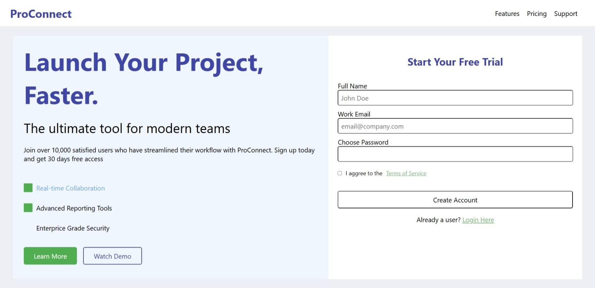
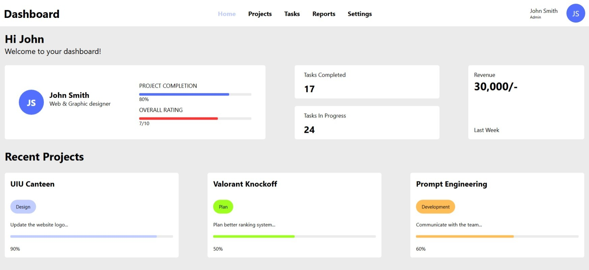

# Mid Term Question Solutions - CSE4165_A

This repository contains **unresponsive** (non-mobile-friendly) solutions to the questions from the Mid Term examination for course **CSE4165_A**.

## Links

- 🔗 **GitHub repository**: [ajpalok/cse4165-midterm-253-solutions](https://github.com/ajpalok/cse4165-midterm-253-solutions)
  
  https://github.com/ajpalok/cse4165-midterm-253-solutions

- 🚀 **Live demo — Code 1 (ProConnect Landing)**: [Open demo (Code1)](https://ajpalok.github.io/cse4165-midterm-253-solutions/code1)
  
  https://ajpalok.github.io/cse4165-midterm-253-solutions/code1

- 🚀 **Live demo — Code 2 (Dashboard Interface)**: [Open demo (Code2)](https://ajpalok.github.io/cse4165-midterm-253-solutions/code2)
  
  https://ajpalok.github.io/cse4165-midterm-253-solutions/code2

## 📄 Mid Term Question Paper

The original question paper can be found here:  
[Mid_Term_Question_253_CSE4165_A.pdf](./Mid_Term_Question_253_CSE4165_A.pdf)

## 📁 Project Structure

This workspace contains two separate solutions:

### 🔗 Code 1 - ProConnect Landing Page

- **Location**: [code1/](./code1/)
- **Files**: 
  - [index.html](./code1/index.html)
  - [style.css](./code1/style.css)
- **Description**: A modern project management tool landing page with "Launch Your Project, Faster" tagline, featuring navigation for Features, Pricing, and Support, with a 30-day free trial offer

### 🔗 Code 2 - Dashboard Interface

- **Location**: [code2/](./code2/)
- **Files**: 
  - [index.html](./code2/index.html)
  - [style.css](./code2/style.css)
- **Description**: An admin dashboard interface with navigation menu (Home, Projects, Tasks, Reports, Settings) and user profile section for John Smith (Admin)

## ⚠️ Important Note

Both solutions are **unresponsive** designs, meaning they are not optimized for mobile devices or different screen sizes. These implementations use fixed layouts and do not include media queries for responsive design.

## 🚀 How to Run

1. Navigate to either `code1/` or `code2/` directory
2. Open the `index.html` file in a web browser
3. View the website (best viewed on desktop/laptop screens)

---

**Course**: CSE4165_A  
**Question Set**: 253
